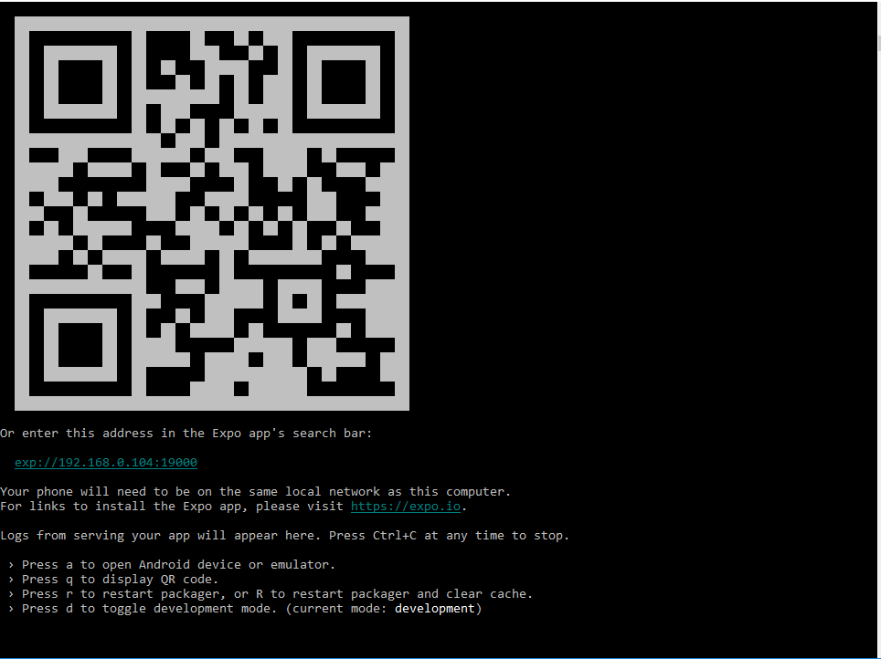

# Flashcards

It allows the user to make decks of flashcards entering series of questions,or take a quiz on the already made decks.
There is a daily notification,prompting the user to take a quiz.
The application has been developed using React Native and Expo and has been tested on an Android device (Samsung Galaxy S8).
The initial project structure was made with the create-react-native-app package,with yarn package manager.

## Installing the needed dependencies 

Before starting the project for the first time,you should install the modules used by it.In order to do this,
you should enter :

```
cd Flashcards
yarn
```

## Starting the project 

To start the projects, you should be in the project's folder and type : 

```
yarn start 

```
When the project initialization is complete,you will see the following screen:




## Project files 

```
+-- src/
 +-- actions/ - action types and action creators used in the app.
  |-- actionTypes.js - list of the application action types
  |-- index.js - application action creators
 +-- reducers/ - application reducer (for retrieving and storing of the decks)
  |-- index.js - application reducer
 +-- utils
  |-- api.js - method for storing and retrieving information from the AsyncStorage
  |-- helpers.js - Contains utility functions used in the application
 +-- components
  |-- AddCard.js - Display of the posts' categories.Calls the action for filtering of posts by category
  |-- CreateDeck.js - Contains details for a comment and the buttons for edit,delete and voting for a comment
  |-- DeckListItem.js - Main component for the comments.Contains a panel with comments header ,
  count of comments for a given post and a button for comments addition
  |-- DeckView.js - Dialog for create/update of comments
  |-- HomeScreen.js - Add/edit posts dialog
  |-- Quiz.js - 404 page of the app
  |-- QuizViewResults.js - Displays detailed view for a post.Contains the post's body,voting mechanism and controls 
  for update and deletion.Also displays the comments made for a given post and allows the user to add,edit or delete comments 
  or vote for them.
```
## Application description

The initial screen of the application shows the available decks : 


You can access the individual deck view by clicking on it. To create a new deck, you should click on the "New deck" tab.

### Creating a new deck 

Clicking the "New deck" tab takes you to the screen for deck creation : 

 

 After entering the title of the new deck, you should confirm the creation by clicking the "Submit button". You will be taken to the individual deck view for the newly created deck.

 ### Individual deck view 

 The individual deck view screen can be accessed in 2 ways : 

 * From the main screen by clicking on a deck's name 
 * After creation of a new deck,the individual deck view is opened for that deck

 The view contains 2 buttons : 

 * Add a card - used to add a new question to the deck 
 * Start quiz - to start a quiz for that deck 


In case the deck does not contain questions,only the Add card button is displayed:


### Add a new card


On this screen the user can enter question and answer to add to the deck.
The new question is saved with the Submit button.
After save, the text fields are cleared,enabling the user to add additional questions.
After the user is finished adding questions,he can go back to the individual deck view by pressing the back button.

### Quiz

The quiz screen shows the questions from a given deck and allows the user to check the answer for a question and mark his guess as correct or incorrect,using the buttons found at the bottom of the screen


The user can toggle between displaying the current question and its answer 
by pressing the red question/answer label found under the text of the question/answer.


When all questions from a deck have been answered, a screen showing the percentage of correct answers appears.


From here,the user can either start the quiz over by pressing the "Start Over" button or go back to the deck view via the "Back to the deck view" button.